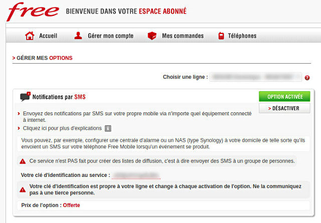

# FreeMobile.hx
    
     
    
  

## Send SMS messages to your Free Mobile account
Send notifications to your own mobile device via any internet-connected device.

For example, you can configure a control panel or a network-attached storage to your home so that they send an SMS to your [Free Mobile](https://mobile.free.fr) phone when an event occurs.

## Quick start

!!! warning
	SMS notifications require an API key. If you are not already registered,
	[sign up for a Free Mobile account](https://mobile.free.fr/subscribe).

### Get an API key
You first need to enable the **SMS notifications** in [your subscriber account](https://mobile.free.fr/moncompte).
This will give you an identification key allowing access to the [Free Mobile](https://mobile.free.fr) API.

  

### Get the library
Install the latest version of **FreeMobile.hx** with your favorite package manager:

=== "Haxe"
		:::shell
		haxelib install free_mobile

=== "JavaScript"
		:::shell
		npm install @cedx/free-mobile.hx

=== "PHP"
		:::shell
		composer require cedx/free-mobile.hx

For detailed instructions, see the [installation guide](installation.md).
