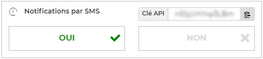

# Free Mobile for Haxe
     

## Send SMS messages to your Free Mobile account
Send notifications to your own mobile device via any internet-connected device.

For example, you can configure a control panel or storage connected to your home network to send an SMS to your [Free Mobile](https://mobile.free.fr) phone when an event occurs.

## Quick start
!> SMS notifications require an API key. If you are not already registered, [sign up for a Free Mobile account](https://mobile.free.fr/subscribe).

### Get an API key
You first need to enable the **SMS notifications** in [your subscriber account](https://mobile.free.fr/account).
This will give you an identification key allowing access to the [Free Mobile](https://mobile.free.fr) API.

  

### Get the library
Install the latest version of **Free Mobile for Haxe** with [lix](https://github.com/lix-pm/lix.client) package manager:

```shell
lix +lib free_mobile
```

For detailed instructions, see the [installation guide](installation.md) and the [usage information](usage.md).
