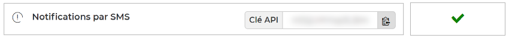

# Free Mobile for Haxe
Send SMS messages to your [Free Mobile](https://mobile.free.fr) device via any internet-connected device.

For example, you can configure a control panel or storage connected to your home network to send a notification to your mobile phone when an event occurs.

## Quick start
> SMS notifications require an API key. If you are not already registered, [sign up for a Free Mobile account](https://mobile.free.fr/subscribe).

### Get an API key
You first need to enable the **SMS notifications** in [your subscriber account](https://mobile.free.fr/account).
This will give you an identification key allowing access to the [Free Mobile](https://mobile.free.fr) API.



### Get the library
Install the latest version of **Free Mobile for Haxe** with [lix](https://github.com/lix-pm/lix.client) package manager:

```shell
lix +lib free_mobile
```

For detailed instructions, see the [installation guide](installation.md).

## Usage
This library provides the `Client` class, which allow to send SMS messages to your mobile phone by using the `sendMessage()` method:

```haxe
import free_mobile.Client;
using tink.CoreApi;

function main() {
  final client = new Client("your account identifier", "your API key");
  // For example: new Client("12345678", "a9BkVohJun4MAf")

  client.sendMessage("Hello World from Haxe!").handle(outcome -> switch outcome {
    case Success(_): trace("The message was sent successfully.");
    case Failure(error): trace('An error occurred: ${error.message}');
  });
}
```

The `Client.sendMessage()` method returns a `Promise` that resolves when the message has been sent.

> The text of the messages will be automatically truncated to **160** characters: you can't send multipart messages using this library.

## See also
- [API reference](api/)
- [Haxelib package](https://lib.haxe.org/p/free_mobile)
- [Code coverage](https://app.codecov.io/gh/cedx/free-mobile.hx)
